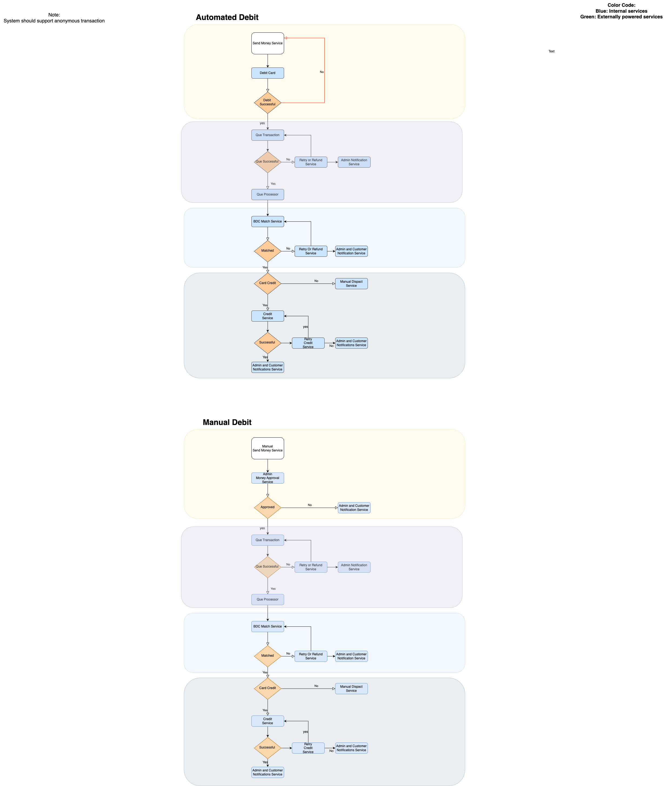

# Peer-Peer Fiat Exchange Microservice

## Overview
Welcome to the **Bureau De Change Microservice**, a Spring Boot-powered microservice designed to facilitate seamless peer-to-peer fiat exchange. This service operates as part of a larger ecosystem, integrating with a debit service to handle transactions efficiently.

## Architecture Overview
Below is a high-level diagram illustrating the Peer-Peer microservice workflow:



## Features
- **Payment Confirmation:** Validates the transaction from the debit service.
- **Merchant Matching:** Finds an appropriate merchant based on trade requirements.
- **Peer Matching:** Pairs the requester with a suitable merchant.
- **Trade Execution:** Ensures a smooth and secure transaction process.

## Why Open Source?
This project is released as open source for evaluation purpose only. If you're interested in deploying a complete peer-to-peer fiat exchange solution, feel free to reach out.

## Getting Started
### Prerequisites
- Java 17+
- Spring Boot 3+
- Maven or Gradle
- PostgreSQL (or any preferred relational database)

### Installation
1. Clone the repository:
   ```sh
   git clone git@github.com:ORC-1/xsage-credit-match-service.git
   ```
2. Configure the application properties (found in `src/main/resources/application.yml`) to match your database setup.
3. Build and run the application:
   ```sh
   mvn clean install
   mvn spring-boot:run
   ```

## Testing
This project includes tests only for the core class: `BureauDeChangeImpl`. Additional test coverage is encouraged for production use.

## Evaluation Copy
For the evaluation copy, tests have only been written for the core class BureauDeChangeImplTest, which tests the BureauDeChangeImpl class.
This project includes tests only for the core class: BureauDeChangeImpl. Additional test coverage is encouraged for production use.

## Disclaimer
🚨 **This project is for demonstration purposes only. It is not intended for production deployment without significant security, compliance, and performance enhancements.**

## Get in Touch
Interested in deploying a fully operational peer-to-peer fiat exchange microservice? Contact **rolandazim@gmail.com** to discuss implementation and custom solutions.

---
⚡ *Empowering seamless fiat transactions with robust microservices!*

